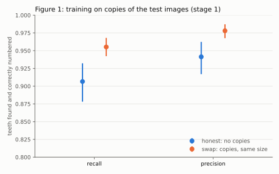

# Caries detection on dental radiographs, with an honest uncertainty budget

An honest reimplementation of dental caries detection on panoramic X-rays yields a system
a clinician could not use. At the operating point fitted for 80% sensitivity, the model
flags **7.0 [6.3, 7.9] healthy teeth on every panoramic**.

That is the result. This repository is about why published numbers for this task look so
much better, and what it takes to produce one that doesn't.

---

## The public release leaks

Before any model was trained, an audit of the DENTEX (MICCAI 2023) release
distributed on HuggingFace as `ibrahimhamamci/DENTEX`, verified 9 October 2026, found:

| Finding | Count |
| --- | --- |
| Test images that are byte-identical copies of images elsewhere in the release | 95 of 250 |
| Validation images likewise | 20 of 50 |
| Re-encoded (non-identical) copies in the whole release | 1 |

`test_181.png` is `train_332.png` from the diagnosis training set. Teeth labelled
"deep caries" in training carry treatment codes in test: tooth 18 becomes "root canal",
tooth 28 "extraction", and tooth 46 "lesion" plus "extraction".

The released test labels are not the challenge's four diagnosis classes. They are eight
Turkish treatment codes. `küretaj` (curettage) sits on incisors 55% of the time, against
4% for deep caries, so it is periodontal treatment, not a depth grade. The official
evaluation script reads a COCO file that is not in the release.

Consequence: the official test split is excluded from evaluation here entirely, for two
independent reasons: the wrong label space, and 38% of it leaked.

Every number above is regenerated by `scripts/audit_dentex.py` from SHA-256 hashes of the
release, after verifying each archive against its published checksum. Full report:
[`results/dentex_audit/report.md`](results/dentex_audit/report.md).

> **Scope of this claim.** These findings describe the HuggingFace release named above,
> which is the distribution this project used. Whether the original challenge
> distribution shares them has not been checked, so the duplication may be an artefact
> of how that release was assembled rather than a property of the benchmark as run.
> Everything stated here is reproducible from the release by `scripts/audit_dentex.py`.

---

## What training on duplicates buys

Three Faster R-CNN tooth enumerators are trained with identical settings and scored on the
same 54 held-out test images that have a human tooth enumeration. A tooth counts when it is
found and correctly numbered (FDI number right, box IoU ≥ 0.5 with the human box).

- **honest** (510 images): no content or patient overlap with any held-out image. None of
  the 54 scored test images is in its training set.
- **size-matched** (510 images): the honest set with 113 images swapped for the excluded
  ones, so all 54 scored test images are in its training set as byte-identical copies.
  Size-matched minus honest isolates the effect of the copies from the effect of
  training-set size.
- **naive** (623 images): the whole enumeration subset, the benchmark's intended protocol.
  Its gain over honest also includes 113 extra training images, so it is shown alongside,
  flagged as confounded.

| | honest | size-matched | naive | size-matched − honest | naive − honest (confounded) |
| --- | --- | --- | --- | --- | --- |
| recall | 0.907 [0.878, 0.932] | 0.955 [0.942, 0.968] | 0.953 [0.940, 0.966] | **0.049 [0.030, 0.070]** | 0.047 [0.028, 0.068] |
| precision | 0.941 [0.917, 0.962] | 0.978 [0.968, 0.987] | 0.981 [0.973, 0.989] | **0.037 [0.021, 0.054]** | 0.040 [0.022, 0.059] |



*Figure 1. Teeth found and correctly numbered, with (size-matched) and without (honest)
byte-identical copies of the scored test images in training, at equal training-set size.
Patient-grouped 95% CIs; differences are paired over the same images.*

At equal training-set size, training on copies of the test images raises recall by
**0.049 [0.030, 0.070]** and precision by **0.037 [0.021, 0.054]**. That roughly halves the
share of teeth missed or misnumbered (9.3% to 4.5%). The naive protocol's gain over honest
has nearly the same point estimates (0.047 recall, 0.040 precision), which suggests the
duplicates, not the extra 113 images, account for it.

The >0.95 tripwire fires on all four size-matched and naive scores. Each is labelled
*expected* in the report, because all 54 scored test images sit inside those models'
training sets. That is the leak this experiment measures, not a result. It does not fire on
the honest model.

**Figure 1 measures enumeration, not diagnosis. The end-to-end effect of the duplicates on
caries detection is not measured.** This is deliberate. Stage 2's head never saw a duplicate,
so a chained measurement would only carry figure 1's enumerator effect through stage 2's extra
noise: a worse measurement of the same thing.

Full report: [`results/dentex_stage1/report.md`](results/dentex_stage1/report.md).

---

## Honest numbers

Two-stage design: a Faster R-CNN enumerates and numbers teeth (stage 1, evaluated in the
section above); a frozen ImageNet ResNet-50 plus a regularised logistic head classifies
each tooth crop (stage 2). **The numbers in this section are stage 2 alone, on human tooth
boxes.** The enumerator is not yet chained in, so its errors are not in these
denominators. This is deliberately unambitious: if a frozen encoder reaches AUC 0.81,
anything more elaborate has to beat that.

**Cohort caveat, which applies to every tooth-level number below.** These describe 253 of
755 images, the only ones with a human tooth inventory. 218 of those 253 fall in a single
recovered acquisition cluster, against 262 of the other 502 (χ², p ≈ 5e-36), and the subset
carries fewer deep caries, periapical lesions and impacted teeth. It is not a random sample
of DENTEX.

At the validation-fitted operating point (threshold 0.122, sensitivity target 0.80):

| | test teeth | lesion detected | depth called correctly |
| --- | --- | --- | --- |
| caries | 190 | 0.79 [0.72, 0.85] | 0.79 [0.72, 0.85] |
| deep caries | 35 | 0.60 [0.44, 0.76] | **0.00** |

| | estimate [95% CI] |
| --- | --- |
| Specificity (1,234 sound teeth) | 0.71 [0.68, 0.74] |
| AUC vs sound — caries / deep caries | 0.81 / 0.77 |
| False-positive teeth per image | 7.0 [6.3, 7.9] |
| ECE / noise floor | 0.041 / 0.028 |
| Recalibration slope | 0.93 [0.79, 1.10] |
| Lesions cleared without referral, at 85% coverage | 0.12 [0.07, 0.17] |

Against a model that does nothing (tooth-level, lesion vs sound, 1,459 test teeth):

| | accuracy | lesions caught |
| --- | --- | --- |
| model at the operating point | 0.718 [0.691, 0.743] | 171 of 225 |
| always predict sound | 0.846 [0.817, 0.874] | 0 of 225 |

Calling every tooth sound beats the model on accuracy by **0.127 [0.086, 0.169]** while
catching no lesions at all. On a mostly sound dentition, headline accuracy rewards doing
nothing, which is why it is never the headline here.

### Why this operating point

The false-positive figure only means something next to the role the model is meant to play.

1. **Deployment role: second reader.** A dentist adjudicates every flag before anything is
   done to the tooth.
2. **The asymmetry that follows.** Caries inverts the usual screening logic. A missed early
   lesion is caught later and restored instead of arrested: a bounded, partly recoverable
   harm. A false positive that is acted on drills a sound tooth: permanent loss of structure,
   and the start of the restorative cycle, each replacement larger than the last, ending in a
   crown or extraction. As a second reader, a false positive costs review time rather than
   tooth structure (with a residual risk that a flag anchors the reviewer towards treatment),
   so sensitivity can be the binding constraint.
3. **Chosen target: sensitivity ≥ 0.80** against the consensus reference, fitted on
   validation. This is provisional; it should be re-anchored to readers' own sensitivity once
   multi-reader data exists, because a second reader far more sensitive than the readers
   mostly adds flags they will overrule.
4. **If the role changes** to autonomous triage, where a flag drives treatment without review,
   specificity becomes the binding constraint and is set first, and sensitivity becomes the
   reported cost. The code enforces this: an `OperatingPoint` for autonomous triage is
   rejected unless specificity binds, and none can be built without a written rationale.

Three things in the tables above are worth reading carefully.

**The model never calls a lesion "deep".** Not once in 35 deep teeth. With 82 deep teeth
among 4,372 in training, L2 regularisation shrinks the class until it can never win the
argmax. This is left unremedied deliberately: class weighting or resampling would fix it,
and fixing it would hide what the standard recipe does to a rare clinical class.

**The missed deep lesions are visible, just under-ranked.** 86% of them sit just below the
threshold (median P(lesion) 0.106 against 0.122). Lowering the threshold would recover them,
at the cost of flagging even more healthy teeth than the current 7 per image. Threshold
choice here is a clinical decision, not a tuning parameter.

**Calibration is the one genuinely good result.** A slope CI spanning 1.0 and an ECE only
marginally above its noise floor mean the probabilities roughly mean what they say. A
well-calibrated weak model is more useful than an overconfident strong-looking one.

Full report: [`results/dentex_stage2_frozen/report.md`](results/dentex_stage2_frozen/report.md).

---

## Methodology rules, enforced in code

These are assertions that fail loudly, not conventions.

1. **Patient-level splits only.** Every split is a `Split` object whose construction runs a
   leakage check; it raises `PatientLeakageError` with an explicit `raise`, not `assert`, so
   `python -O` cannot strip it. One test runs it under `-O` to prove this.
2. **No pooled metrics across lesion depth.** Sensitivity and AUC are reported per depth
   level. Pooled figures appear only beside the stratified ones.
3. **Inter-observer agreement is the ceiling, not the floor.** The ceiling for a reader is
   the leave-one-out consensus of the others, not another individual. A model trained on
   consensus beats individuals by construction, so comparing it to them would flag healthy
   models as suspect.
4. **External validation is the real number.** Internal metrics are reported alongside the
   cross-dataset gap. Where no external dataset exists, the report says rule 4 has nothing
   behind it rather than presenting internal numbers alone.
5. **No metric without a confidence interval**, bootstrapped over patients rather than
   images. When patients contribute several images (bitewings come in fours), image-level
   resampling produces intervals about half as wide, and wrong. On DENTEX, with one image
   per patient, the two coincide.
6. **Tooth inventories come from human enumeration.** Tooth-level metrics refuse to run
   unless the inventory came from human enumeration labels. An inventory rebuilt from
   diagnosis boxes contains only diseased teeth, so sound teeth vanish and every denominator
   becomes meaningless.

Plus a **>0.95 tripwire**: any performance figure above 0.95 is flagged at the top of the
report. Flags resting on fewer than 20 units are listed separately as likely noise.

The harness has a self-test. `configs/synthetic_e0_leaky.yaml` combines an image-level
split with patients spanning 2–4 images and a model that memorises what it trained on. Its
report raises 12 flags and states that 75% of patients cross partitions. The clean run is
asserted to raise none. A measuring instrument never observed responding to a known signal
is not trustworthy.

---

## What could not be computed, and why

Stated plainly because the alternative is a silent omission.

**Rule 3 has no data on this cohort.** DENTEX ships a single consensus annotation. The
agreement machinery (Cohen's and Fleiss' kappa, Krippendorff's alpha, the leave-one-out
ceiling, the kappa-versus-threshold sweep) is built and tested against a four-reader
synthetic fixture, and has nothing to run on here.

**Rule 4 has no external dataset.** No second cohort was available at time of writing.

**Patient grouping could not be recovered, and probably does not exist.** DENTEX ships no
patient identifiers; patients aged 12 and over were randomly selected for privacy. Recovery
was attempted on thumbnail embeddings and on full-image ResNet-50 features. The
two-component fit is not preferred (ΔBIC +1.1), the highest similarity in the set is 0.84
with no tail, and manual inspection of the top pairs shows different mouths sharing
acquisition framing. One image per patient is the plausible reading. The split is therefore
effectively image-level, and the leakage evidence for DENTEX rests on the byte-identical
duplicates instead.

**Subgroup analysis by age and sex** is not computable, because the release carries no
demographics.

---

## Future work

- Chain stage 2 to the enumerator, so tooth-level metrics cover all 755 images rather than
  the 253 with a human inventory, with the enumerator's own errors carried into the
  denominators.

---

## Running it

```bash
pip install -e ".[train,dev]"
pytest                                    # 372 tests, no GPU required

python scripts/audit_dentex.py --data data/dentex/raw --out results/dentex_audit
python scripts/run_dentex.py --config configs/dentex_stage2_frozen.yaml \
    --data data/dentex/raw --out results/dentex_stage2_frozen
python scripts/run_stage1.py --config configs/dentex_stage2_frozen.yaml \
    --data data/dentex/raw --out results/dentex_stage1 --epochs 12
```

The evaluation harness (`src/dcai/eval/`) is pure numpy/scipy/scikit-learn and imports
without torch, so it is testable in CI. The training stack lives behind the `[train]` extra.

Code in this repository is MIT-licensed (see [`LICENSE`](LICENSE)). Data is not committed
and is gitignored. DENTEX is available from
[HuggingFace](https://huggingface.co/datasets/ibrahimhamamci/DENTEX) under
**CC-BY-NC-SA 4.0**: non-commercial use only, and share-alike plausibly reaches weights
derived from it.

---

## Repository layout

```
src/dcai/
  data/     schema, patient splits with leakage guards, DENTEX loader, near-duplicate detection
  eval/     agreement, stratified metrics, calibration, abstention, detection, bootstrap
  probes/   patient and site recovery, source-shortcut probe
  models/   tooth enumerator, frozen-encoder tooth classifier
configs/    one per experiment, including the deliberately-leaking fixture
scripts/    audit, stage 1, stage 2 (run_dentex.py), group recovery, synthetic experiments
results/    generated reports and figures
```
