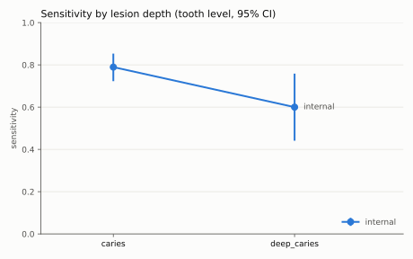
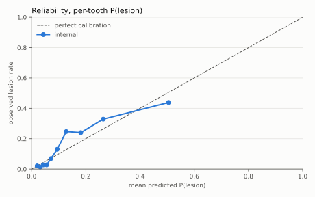

# Evaluation report: dentex_stage2_frozen_resnet50

## Model and data, for this run

- Data: DENTEX (HuggingFace `ibrahimhamamci/DENTEX`, CC-BY-NC-SA 4.0). Evaluation set: 755 depth-labelled images (diagnosis train + validation), of which **253** have a human tooth inventory from an enumeration-subset copy. Every number below uses those images only.

- Patients: recovered from pixels (0 probable same-patient pairs; mixture separated: False; Ashman's D 0.75). The split is over recovered patients.

- Stage 2 only: frozen ImageNet ResNet-50 features on human tooth crops, plus a multinomial logistic head (C = 0.0003, chosen by patient-grouped CV log-loss) trained on 4372 train-partition teeth. No stage-1 enumerator yet: the tooth boxes are human.

## Integrity checks, for this run

- Exact duplicates inside the evaluation set: 0 (the loader refuses them). Near-duplicate pairs by pixel evidence: 0, every one inside a single recovered patient group, so none can cross the split.

- Are the inventoried images a random subset of the evaluation set? Patient-grouped 95% CIs; tests uncorrected and exploratory:

| | inventoried (253) | not inventoried (502) | test |
|---|---|---|---|
| image width, median px | 2842 | 2872 | Mann-Whitney p = 2.95e-08 |
| image height, median px | 1316 | 1316 | Mann-Whitney p = 2.49e-37 |
| recovered site cluster (k = 3, silhouette 0.48), images per cluster | [218, 10, 25] | [262, 236, 4] | χ² p = 5.41e-36 |
| share of images with caries | 0.901 [0.862, 0.937] | 0.861 [0.829, 0.890] | difference 0.041 [-0.005, 0.088] |
| share of images with deep_caries | 0.372 [0.312, 0.431] | 0.492 [0.448, 0.536] | difference -0.120 [-0.196, -0.045] |
| share of images with periapical_lesion | 0.083 [0.051, 0.123] | 0.203 [0.169, 0.239] | difference -0.120 [-0.170, -0.069] |
| share of images with impacted_tooth | 0.292 [0.237, 0.352] | 0.390 [0.349, 0.432] | difference -0.098 [-0.169, -0.027] |

**The inventoried images differ from the rest on at least one of these, so every tooth-level number below carries a selection effect: it describes the enumeration-copy subset, not DENTEX as a whole.**

dcai 0.1.0 · seed 20261009 · 2000 bootstrap resamples · scale `dentex_depth`

### How to read this report

- **Every interval is a 95% percentile bootstrap, resampled by patient, uncorrected for multiple comparisons, and exploratory.** The only exceptions are the headline claims, which carry Bonferroni-corrected intervals.
- ⚠ marks any performance estimate above 0.95. At these sample sizes, explain it (look for leakage first) before believing it.
- Tooth-level metrics use the strict-majority reader consensus as reference. Lesion-level detection is scored against each reader separately.

### Leakage tripwire

No performance estimate resting on ≥ 20 units exceeds 0.95.

## Headline claims (pre-specified)

The three claims fixed in advance, with **Bonferroni-corrected 98.33% intervals** (family-wise α = 0.05). Sensitivities are tooth-level at the frozen operating point. The external gaps compare independent samples.

| claim | estimate [98.33% CI] | verdict |
|---|---|---|
| Depth gap, internal test: sensitivity(deep_caries) - sensitivity(caries) | -0.189 [-0.412, 0.004] | **includes 0: not supported** |
| External drop in caries sensitivity: internal - external | not computable | no external dataset |
| External drop in deep_caries sensitivity: internal - external | not computable | no external dataset |

## 1. Data and splits

| set | images | patients | teeth | max images / patient | sites | multi-reader images | patient ids | tooth inventory |
|---|---|---|---|---|---|---|---|---|
| internal test | 51 | 51 | 1459 | 1 | — | 0 | assumed_unique 51 | annotated 51 |

Internal set, patient-level split. The leakage check ran at construction and passed: 253 patients, none in more than one partition; 0.0% of test images belong to a seen patient.

| partition | images | patients |
|---|---|---|
| train | 152 | 152 |
| val | 50 | 50 |
| test | 51 | 51 |

A naive image-level split of the same data would put **0 of 253 patients (0.0%)** in more than one partition. That is the contamination an image-level split carries. E0 reproduces it deliberately.

> naive image-level split leaked no patients (every patient has one image, or ids are assumed unique). Image- and patient-level splits coincide on this data, so the E0 -> E1 drop is zero by construction.

## 2. Reader agreement (internal test, tooth level)

1459 teeth in 51 images, readers consensus. The unit is the tooth (FDI), so readers are paired with no box-matching step. Cohen's kappa uses linear weights on the ordinal depth scale.

- Agreement: rule 3 has no data on this cohort: one reader only (consensus), so inter-observer agreement and the human ceiling are not computable

- Fleiss' kappa: rule 3 has no data on this cohort: one reader only (consensus), so inter-observer agreement and the human ceiling are not computable

Individual reader pairs (how much humans disagree; this is *not* the ceiling):

| reader A | reader B | teeth | kappa |
|---|---|---|---|

Ceiling not computable: rule 3 has no data on this cohort: one reader only (consensus), so inter-observer agreement and the human ceiling are not computable

## 3. Depth-stratified tooth-level performance

Operating point fitted on internal *validation* patients only. Deployment role: **second reader**; binding constraint: **sensitivity ≥ 0.80** (achieved 0.800 on validation) at threshold **0.122** on P(lesion). It is frozen for internal test and external.

> Rationale on record: Deployment role: second reader. A dentist adjudicates every flag before anything is done to the tooth. Asymmetry: caries inverts the usual screening asymmetry. A missed early lesion is found later and restored instead of arrested, a bounded and partly recoverable harm. A false positive that is acted on drills sound tooth structure and starts the restorative cycle. In this role a false positive costs review time rather than tooth structure (residual risk: a flag can anchor the reviewer towards treatment), so sensitivity may bind. Target: sensitivity >= 0.80 against the consensus reference. This is provisional, to be re-anchored to the readers' own sensitivity once the agreement analysis runs on real data: a second reader far more sensitive than the readers mostly adds flags they will overrule. If the role changes to autonomous triage (a flag drives treatment), specificity becomes the binding constraint, its target is set first, and sensitivity becomes the reported cost.

Reference standard: strict-majority consensus of each image's readers, per tooth.

| depth | n (internal) | sensitivity (internal) | AUC vs sound (internal) |
|---|---|---|---|
| **caries** | 190 | 0.789 [0.723, 0.853] | 0.811 [0.774, 0.846] |
| **deep_caries** | 35 | 0.600 [0.441, 0.759] | 0.768 [0.713, 0.821] |
| sound teeth: specificity | 1234 | 0.711 [0.676, 0.740] | — |
| *pooled sensitivity (shown only to expose what pooling hides)* | 225 | 0.760 [0.700, 0.824] | — |

## 4. Lesion-level detection, per reader

Boxes matched to each reader's own lesions (IoU ≥ 0.5); sensitivity and FP/image at box score ≥ 0.122 (the operating threshold). AP per depth ignores lesions of the other depth, and background false positives count against every depth.

**internal test**

| reader | images | sens caries | sens deep_caries | FP / image | AP caries | AP deep_caries | *pooled AP* |
|---|---|---|---|---|---|---|---|
| consensus | 51 | 0.780 [0.707, 0.849] | 0.600 [0.433, 0.759] | 7.020 [6.255, 7.922] | 0.379 [0.304, 0.476] | 0.109 [0.052, 0.201] | 0.403 [0.334, 0.489] |

## 5. Calibration (tooth level)

Per-tooth P(lesion) against the consensus reference. Box scores are deliberately not calibrated, because a detector chooses how many boxes to emit. The noise floor is the 95th percentile of ECE for a perfectly calibrated model at this n. Slope < 1 means overconfident; intercept < 0 means it over-predicts.

| set | teeth | prevalence | mean P | ECE (quantile bins) | ECE noise floor | exceeds floor | Brier | slope | intercept |
|---|---|---|---|---|---|---|---|---|---|
| internal test | 1459 | 0.154 | 0.140 | 0.041 [0.027, 0.067] | 0.028 | yes | 0.112 [0.095, 0.131] | 0.933 [0.786, 1.098] | 0.040 [-0.270, 0.372] |

## 6. Abstention at the operating point

Teeth within ±0.028 of the threshold are referred to a clinician; the band was sized on validation for 85.0% coverage. *Missed positive rate* is lesions the system cleared without referral, as a share of all lesions. That is the number that matters clinically.

| set | coverage | sens (accepted) | spec (accepted) | missed positive rate | sens (no abstention) | spec (no abstention) | patients shared with fitting set |
|---|---|---|---|---|---|---|---|
| internal test | 0.850 [0.828, 0.871] | 0.849 [0.781, 0.912] | 0.729 [0.697, 0.760] | 0.116 [0.067, 0.168] | 0.760 [0.700, 0.824] | 0.711 [0.676, 0.740] | 0 |

## 7. Subgroups

Depth-stratified within every subgroup: age is confounded with lesion depth, so a pooled per-age sensitivity would invent an age effect.

**internal test, by age**: no age metadata on any of 1459 units: not computable on this data.

**internal test, by sex**: no sex metadata on any of 1459 units: not computable on this data.

## 8. Not computable on this data

- internal test, subgroups by age: no age metadata on any of 1459 units: not computable on this data
- internal test, subgroups by sex: no sex metadata on any of 1459 units: not computable on this data
- no external dataset: rule 4 (external validation is the real number) has nothing behind it yet, so every number here is internal
- internal test: rule 3 has no data on this cohort: one reader only (consensus), so inter-observer agreement and the human ceiling are not computable
