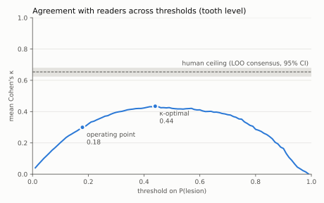
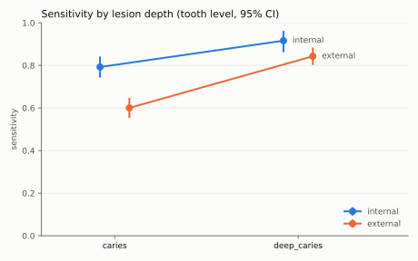
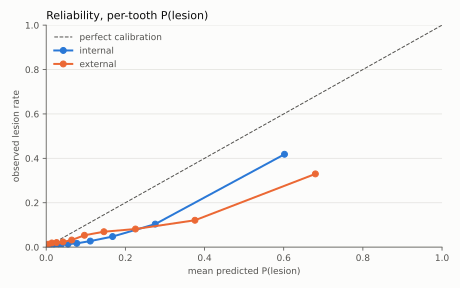

# Evaluation report: synthetic_e2e

> **SYNTHETIC DATA.** Every number below is a property of the generator (`dcai/data/synthetic.py`, `dcai/simulate.py`), not of any trained model. This run exists to show that the harness composes end to end.

dcai 0.1.0 · seed 20261009 · 2000 bootstrap resamples · scale `dentex_depth`

### How to read this report

- **Every interval is a 95% percentile bootstrap, resampled by patient, uncorrected for multiple comparisons, and exploratory.** The only exceptions are the headline claims, which carry Bonferroni-corrected intervals.
- ⚠ marks any performance estimate above 0.95. At these sample sizes, explain it (look for leakage first) before believing it.
- Tooth-level metrics use the strict-majority reader consensus as reference. Lesion-level detection is scored against each reader separately.

### Leakage tripwire

No performance estimate resting on ≥ 20 units exceeds 0.95.

## Headline claims (pre-specified)

The three claims fixed in advance, with **Bonferroni-corrected 98.33% intervals** (family-wise α = 0.05). Sensitivities are tooth-level at the frozen operating point. The external gaps compare independent samples.

| claim | estimate [98.33% CI] | verdict |
|---|---|---|
| Depth gap, internal test: sensitivity(deep_caries) - sensitivity(caries) | 0.124 [0.040, 0.208] | excludes 0 |
| External drop in caries sensitivity: internal - external | 0.192 [0.110, 0.271] | excludes 0 |
| External drop in deep_caries sensitivity: internal - external | 0.073 [-0.009, 0.153] | **includes 0: not supported** |

## 1. Data and splits

| set | images | patients | teeth | max images / patient | sites | multi-reader images | patient ids | tooth inventory |
|---|---|---|---|---|---|---|---|---|
| internal test | 212 | 142 | 5880 | 2 | site_a, site_b, site_c | 212 | provided 212 | annotated 212 |
| external | 379 | 250 | 10665 | 2 | site_ext | 379 | provided 379 | annotated 379 |

Internal set, patient-level split. The leakage check ran at construction and passed: 700 patients, none in more than one partition; 0.0% of test images belong to a seen patient.

| partition | images | patients |
|---|---|---|
| train | 637 | 424 |
| val | 214 | 134 |
| test | 212 | 142 |

A naive image-level split of the same data would put **209 of 700 patients (29.9%)** in more than one partition. That is the contamination an image-level split carries. E0 reproduces it deliberately.

## 2. Reader agreement (internal test, tooth level)

5880 teeth in 212 images, readers r1, r2, r3, r4. The unit is the tooth (FDI), so readers are paired with no box-matching step. Cohen's kappa uses linear weights on the ordinal depth scale.

- Krippendorff's alpha (ordinal, handles unread images): **0.632 [0.603, 0.658]**

- Fleiss' kappa: not computable: needs a complete design, but some readers did not read every image; use Krippendorff's alpha

Individual reader pairs (how much humans disagree; this is *not* the ceiling):

| reader A | reader B | teeth | kappa |
|---|---|---|---|
| r1 | r2 | 5517 | 0.607 [0.569, 0.639] |
| r1 | r3 | 5372 | 0.603 [0.563, 0.641] |
| r1 | r4 | 5542 | 0.580 [0.541, 0.615] |
| r2 | r3 | 5345 | 0.608 [0.569, 0.640] |
| r2 | r4 | 5515 | 0.586 [0.546, 0.624] |
| r3 | r4 | 5370 | 0.566 [0.527, 0.603] |

**Model against the human ceiling, across thresholds.** The ceiling for reader X is the agreement between X and the leave-one-out consensus of the other readers, so a consensus-trained model is compared with a consensus (matched variance). The band is the mean ceiling over readers. Kappa at one threshold would mix "worse than readers" with "pinned to a threshold readers don't use", so the model is swept.

- Human ceiling (mean LOO-consensus κ): **0.654 [0.626, 0.678]**

- Model at the operating point (threshold 0.179): 0.300 [0.271, 0.328]

- Model at its κ-optimal threshold (0.440): 0.434 [0.399, 0.467]. This threshold was chosen on these data, so the value is optimistic: a diagnostic, not a deployable number.

- Does any threshold reach the band? **no**: at no threshold does the model agree with readers as well as their own consensus does.

**The operating point and the κ-optimal threshold differ a lot.** Moving the threshold from 0.179 to 0.440 raises κ by 0.135 [0.109, 0.162] (paired). At the deployed threshold the model calls lesions far more readily than the readers do, and that part of the shortfall is the price of the binding constraint. It is not the whole story: even at its best threshold the model stays below the band, so the rest of the gap is the model.

Per reader, at the κ-optimal threshold (0.440), the model's most charitable setting. If it does not exceed a reader's ceiling here, it does not exceed it anywhere.

| reader | teeth | model κ | ceiling κ (LOO consensus) | mean individual κ | model − ceiling | verdict |
|---|---|---|---|---|---|---|
| r1 | 5712 | 0.446 [0.408, 0.485] | 0.659 [0.626, 0.689] | 0.596 [0.568, 0.623] | -0.213 [-0.254, -0.173] | below ceiling |
| r2 | 5685 | 0.432 [0.389, 0.474] | 0.666 [0.633, 0.697] | 0.600 [0.573, 0.625] | -0.235 [-0.279, -0.191] | below ceiling |
| r3 | 5540 | 0.429 [0.389, 0.467] | 0.641 [0.605, 0.675] | 0.592 [0.561, 0.620] | -0.212 [-0.258, -0.171] | below ceiling |
| r4 | 5710 | 0.431 [0.386, 0.472] | 0.648 [0.613, 0.682] | 0.577 [0.547, 0.605] | -0.217 [-0.259, -0.174] | below ceiling |

*Exceeding the ceiling is not a success.* It means reader mimicry, leakage, or a model that averages label noise better than an (N−1)-reader panel. It needs explaining.

## 3. Depth-stratified tooth-level performance

Operating point fitted on internal *validation* patients only. Deployment role: **second reader**; binding constraint: **sensitivity ≥ 0.80** (achieved 0.800 on validation) at threshold **0.179** on P(lesion). It is frozen for internal test and external.

> Rationale on record: Deployment role: second reader. A dentist adjudicates every flag before anything is done to the tooth. Asymmetry: caries inverts the usual screening asymmetry. A missed early lesion is found later and restored instead of arrested, a bounded and partly recoverable harm. A false positive that is acted on drills sound tooth structure and starts the restorative cycle. In this role a false positive costs review time rather than tooth structure (residual risk: a flag can anchor the reviewer towards treatment), so sensitivity may bind. Target: sensitivity >= 0.80 against the consensus reference. This is provisional, to be re-anchored to the readers' own sensitivity once the agreement analysis runs on real data: a second reader far more sensitive than the readers mostly adds flags they will overrule. If the role changes to autonomous triage (a flag drives treatment), specificity becomes the binding constraint, its target is set first, and sensitivity becomes the reported cost.

Reference standard: strict-majority consensus of each image's readers, per tooth.

| depth | n (internal) | sensitivity (internal) | AUC vs sound (internal) | n (external) | sensitivity (external) | AUC vs sound (external) |
|---|---|---|---|---|---|---|
| **caries** | 236 | 0.792 [0.743, 0.842] | 0.882 [0.862, 0.902] | 483 | 0.600 [0.553, 0.648] | 0.739 [0.715, 0.765] |
| **deep_caries** | 143 | 0.916 [0.861, 0.962] | 0.944 [0.920, 0.963] | 331 | 0.843 [0.802, 0.883] | 0.874 [0.854, 0.894] |
| sound teeth: specificity | 5501 | 0.808 [0.797, 0.820] | — | 9851 | 0.732 [0.723, 0.740] | — |
| *pooled sensitivity (shown only to expose what pooling hides)* | 379 | 0.839 [0.803, 0.875] | — | 814 | 0.699 [0.664, 0.735] | — |

## 4. Lesion-level detection, per reader

Boxes matched to each reader's own lesions (IoU ≥ 0.5); sensitivity and FP/image at box score ≥ 0.3. AP per depth ignores lesions of the other depth, and background false positives count against every depth.

**internal test**

| reader | images | sens caries | sens deep_caries | FP / image | AP caries | AP deep_caries | *pooled AP* |
|---|---|---|---|---|---|---|---|
| r1 | 206 | 0.448 [0.389, 0.505] | 0.807 [0.746, 0.864] | 2.306 [2.118, 2.498] | 0.220 [0.166, 0.283] | 0.521 [0.455, 0.594] | 0.435 [0.386, 0.485] |
| r2 | 205 | 0.505 [0.444, 0.567] | 0.777 [0.707, 0.841] | 2.405 [2.203, 2.617] | 0.196 [0.143, 0.265] | 0.463 [0.395, 0.545] | 0.436 [0.387, 0.493] |
| r3 | 200 | 0.372 [0.324, 0.423] | 0.808 [0.745, 0.866] | 2.255 [2.062, 2.448] | 0.205 [0.162, 0.257] | 0.551 [0.481, 0.632] | 0.414 [0.366, 0.467] |
| r4 | 206 | 0.571 [0.500, 0.647] | 0.778 [0.711, 0.846] | 2.481 [2.286, 2.689] | 0.275 [0.216, 0.347] | 0.423 [0.354, 0.510] | 0.454 [0.399, 0.515] |

**external**

| reader | images | sens caries | sens deep_caries | FP / image | AP caries | AP deep_caries | *pooled AP* |
|---|---|---|---|---|---|---|---|
| r1 | 368 | 0.348 [0.307, 0.391] | 0.680 [0.633, 0.723] | 4.117 [3.915, 4.315] | 0.092 [0.070, 0.121] | 0.292 [0.246, 0.343] | 0.260 [0.228, 0.294] |
| r2 | 365 | 0.361 [0.315, 0.406] | 0.658 [0.605, 0.706] | 4.140 [3.930, 4.348] | 0.097 [0.073, 0.129] | 0.265 [0.219, 0.314] | 0.253 [0.220, 0.288] |
| r3 | 357 | 0.300 [0.269, 0.336] | 0.684 [0.638, 0.729] | 4.025 [3.798, 4.242] | 0.089 [0.072, 0.110] | 0.297 [0.250, 0.349] | 0.243 [0.214, 0.273] |
| r4 | 366 | 0.419 [0.374, 0.470] | 0.665 [0.619, 0.711] | 4.161 [3.956, 4.361] | 0.127 [0.100, 0.160] | 0.229 [0.190, 0.274] | 0.259 [0.227, 0.294] |

## 5. Calibration (tooth level)

Per-tooth P(lesion) against the consensus reference. Box scores are deliberately not calibrated, because a detector chooses how many boxes to emit. The noise floor is the 95th percentile of ECE for a perfectly calibrated model at this n. Slope < 1 means overconfident; intercept < 0 means it over-predicts.

| set | teeth | prevalence | mean P | ECE (quantile bins) | ECE noise floor | exceeds floor | Brier | slope | intercept |
|---|---|---|---|---|---|---|---|---|---|
| internal test | 5880 | 0.064 | 0.137 | 0.073 [0.066, 0.079] | 0.013 | yes | 0.050 [0.046, 0.054] | 1.196 [1.109, 1.297] | -1.004 [-1.187, -0.835] |
| external | 10665 | 0.076 | 0.168 | 0.094 [0.089, 0.099] | 0.010 | yes | 0.082 [0.078, 0.086] | 0.683 [0.631, 0.738] | -1.445 [-1.544, -1.348] |

## 6. Abstention at the operating point

Teeth within ±0.059 of the threshold are referred to a clinician; the band was sized on validation for 85.0% coverage. *Missed positive rate* is lesions the system cleared without referral, as a share of all lesions. That is the number that matters clinically.

| set | coverage | sens (accepted) | spec (accepted) | missed positive rate | sens (no abstention) | spec (no abstention) | patients shared with fitting set |
|---|---|---|---|---|---|---|---|
| internal test | 0.846 [0.836, 0.855] | 0.892 [0.860, 0.924] | 0.844 [0.833, 0.855] | 0.095 [0.067, 0.123] | 0.839 [0.803, 0.875] | 0.808 [0.797, 0.820] | 0 |
| external | 0.839 [0.832, 0.846] | 0.750 [0.715, 0.787] | 0.760 [0.750, 0.769] | 0.214 [0.182, 0.245] | 0.699 [0.664, 0.735] | 0.732 [0.723, 0.740] | 0 |

## 7. Subgroups

Depth-stratified within every subgroup: age is confounded with lesion depth, so a pooled per-age sensitivity would invent an age effect.

**internal test, by age** (metadata coverage 100.0%)

| age | teeth | patients | sens caries | sens deep_caries | note |
|---|---|---|---|---|---|
| 18-34 | 1316 | 32 | 0.811 [0.674, 0.931] | 0.882 [0.684, 1.000] |  |
| 35-49 | 1565 | 38 | 0.814 [0.714, 0.897] | 0.947 [0.826, 1.000] |  |
| 50-64 | 1889 | 43 | 0.787 [0.708, 0.862] | 0.913 [0.837, 0.980] |  |
| 65+ | 1110 | 29 | 0.750 [0.611, 0.871] | 0.905 [0.786, 1.000] |  |

**internal test, by sex** (metadata coverage 100.0%)

| sex | teeth | patients | sens caries | sens deep_caries | note |
|---|---|---|---|---|---|
| female | 3019 | 72 | 0.800 [0.730, 0.861] | 0.907 [0.832, 0.966] |  |
| male | 2861 | 70 | 0.780 [0.701, 0.854] | 0.930 [0.847, 1.000] |  |

**external, by age**: no age metadata on any of 10665 units: not computable on this data.

**external, by sex**: no sex metadata on any of 10665 units: not computable on this data.

## 8. Not computable on this data

- external, subgroups by age: no age metadata on any of 10665 units: not computable on this data
- external, subgroups by sex: no sex metadata on any of 10665 units: not computable on this data
- internal test: Fleiss' kappa not computable: needs a complete design, but some readers did not read every image; use Krippendorff's alpha
